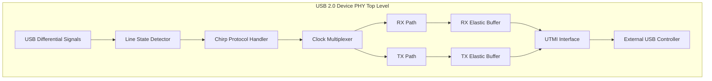
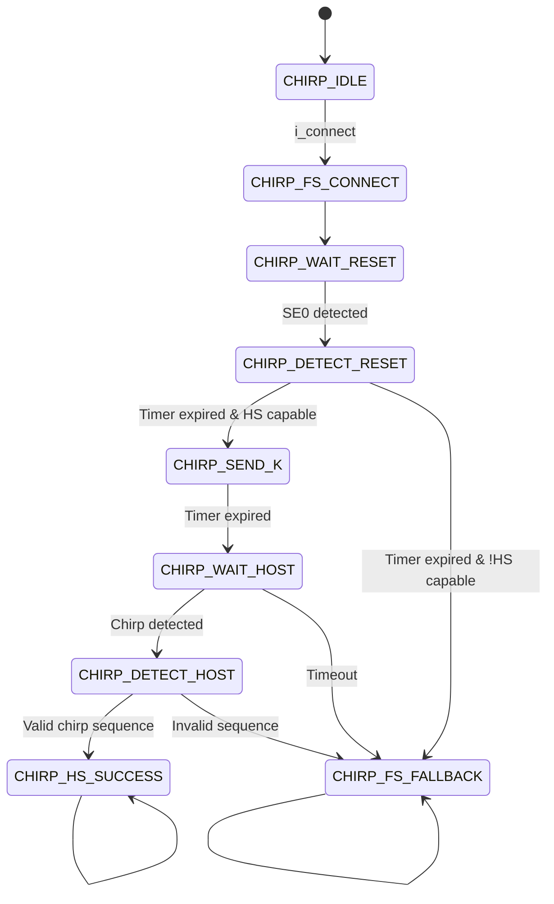
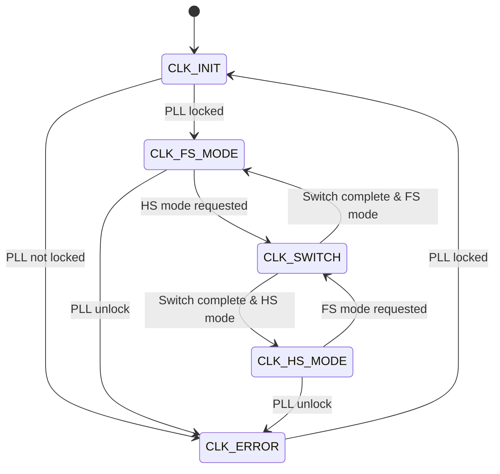
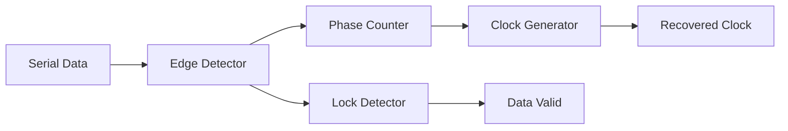
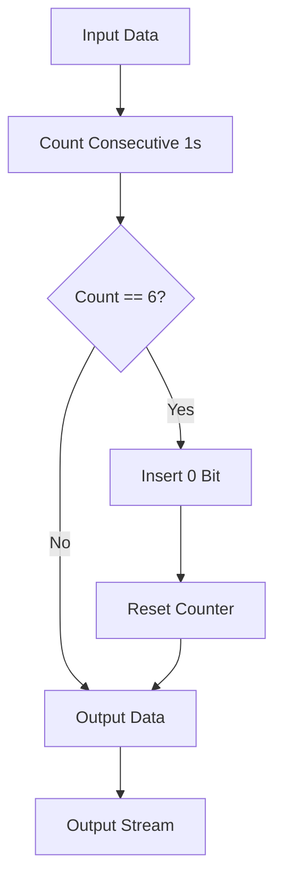
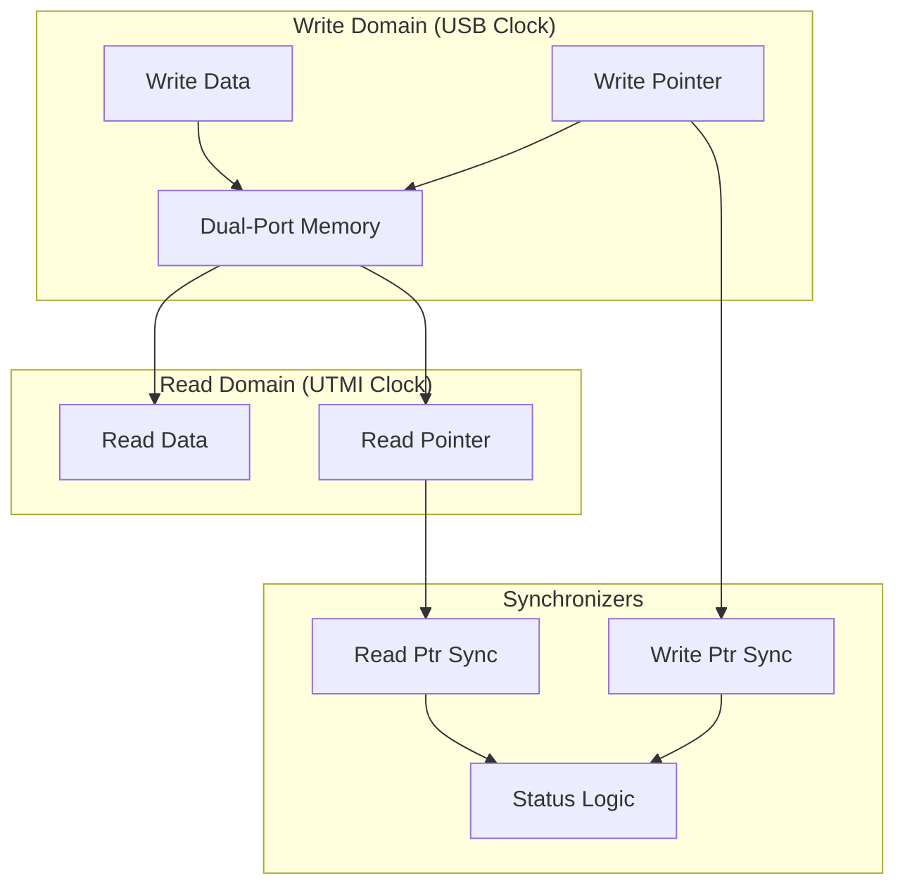
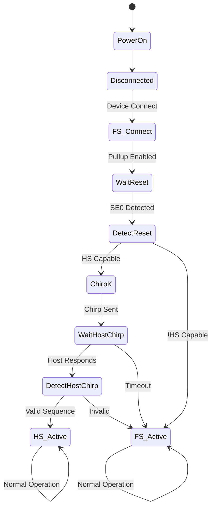
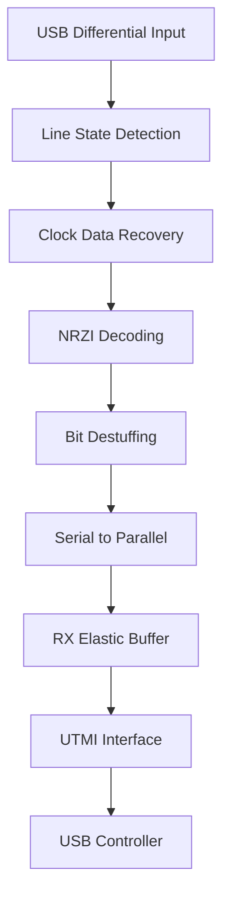
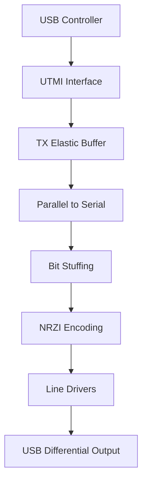
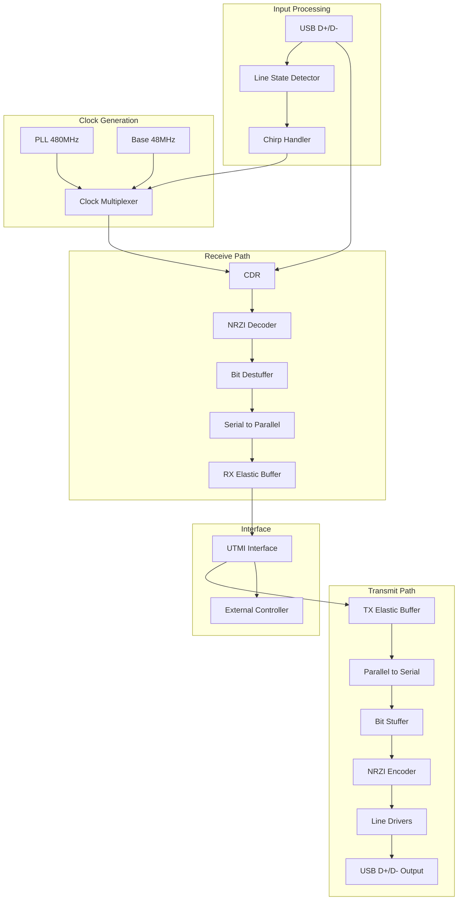

# USB 2.0 Device Digital Physical Layer

## Table of Contents
1. [System Overview](#system-overview)
2. [Module Descriptions](#module-descriptions)
3. [State Machine Diagrams](#state-machine-diagrams)
4. [Data Flow Diagrams](#data-flow-diagrams)
5. [Timing Diagrams](#timing-diagrams)
6. [Theoretical Background](#theoretical-background)

---

## System Overview

The USB 2.0 Device Digital Physical Layer is a complete implementation that handles all digital aspects of USB 2.0 communication for device-side operations. The design supports both Full Speed (12 Mbps) and High Speed (480 Mbps) modes with automatic speed negotiation.

### Key Features
- **Speed Detection**: Automatic HS/FS capability detection
- **Chirp Protocol**: Complete implementation with timing compliance
- **Glitch-Free Clock Switching**: Between 12MHz (FS) and 480MHz (HS)
- **NRZI Encoding/Decoding**: Complete data encoding for USB
- **Bit Stuffing/Destuffing**: USB protocol compliance
- **Clock and Data Recovery (CDR)**: For incoming data streams
- **Elastic Buffers**: Clock Domain Crossing (CDC) handling
- **UTMI Interface**: Standard USB Transceiver Macrocell Interface

### Architecture Overview



---

## Module Descriptions

### 1. Line State Detector (`usb2_line_state_detector`)

**Purpose**: Detects and decodes USB line states from differential signals.

**Functionality**:
- Synchronizes incoming D+/D- signals
- Decodes line states (SE0, J, K, SE1)
- Handles HS/FS mode differences
- Implements squelch detection for High Speed mode

**Key Features**:
- Input synchronization for metastability protection
- Mode-dependent line state interpretation
- Squelch threshold detection for HS mode

### 2. Chirp Protocol Handler (`usb2_chirp_handler`)

**Purpose**: Implements USB 2.0 speed negotiation protocol.

**State Machine**:


**Timing Parameters**:
- Reset detection: >10ms SE0
- Chirp K duration: 1-7ms (implementation uses 3ms)
- Host response timeout: 100ms
- Chirp detection window: 50μs per transition

### 3. Glitch-Free Clock Multiplexer (`usb2_clock_mux`)

**Purpose**: Provides glitch-free switching between FS (12MHz) and HS (480MHz) clocks.

**State Machine**:


**Glitch Prevention Technique**:
1. Synchronize clock select signals to both domains
2. Use inverted enable logic for clean transitions
3. Gate clocks individually before multiplexing
4. Implement switching delays for setup/hold timing

### 4. Clock and Data Recovery (`usb2_cdr`)

**Purpose**: Recovers clock and data from incoming serial USB stream.

**Algorithm**:
- Edge detection on incoming data transitions
- Phase-locked loop (PLL) for clock generation
- Lock detection based on consistent edge timing
- Adaptive phase tracking for frequency variations

**Implementation**:


### 5. NRZI Encoder/Decoder

**Purpose**: Implements Non-Return-to-Zero Inverted encoding for USB.

**NRZI Encoding Rules**:
- Logic '1': No transition (maintain previous state)
- Logic '0': Transition (invert previous state)

**Decoder Logic**:
```verilog
o_data <= ~(i_data ^ data_prev);  // XOR for transition detection
```

**Encoder Logic**:
```verilog
if (i_data == 1'b1) 
    o_data <= prev_output;      // No transition
else 
    o_data <= ~prev_output;     // Transition
```

### 6. Bit Stuffer/Destuffer

**Purpose**: Implements USB bit stuffing for data integrity.

**Bit Stuffing Rules**:
- Insert '0' after 6 consecutive '1's
- Receiver removes stuffed bits
- Violation detection for error handling

**Implementation Flow**:


### 7. Serial-to-Parallel / Parallel-to-Serial Converters

**Purpose**: Convert between serial USB data and parallel interface.

**S2P Operation**:
- Shift register accumulates incoming bits
- Output valid when complete byte received
- SYNC pattern detection for frame alignment

**P2S Operation**:
- Load parallel data into shift register
- Shift out MSB first
- Generate done signal when complete

### 8. Elastic Buffer (`usb2_elastic_buffer`)

**Purpose**: Handles Clock Domain Crossing (CDC) between USB and UTMI domains.

**Architecture**:


**Gray Code Pointers**: Prevent metastability during CDC
**Status Flags**: Full, empty, overflow, underflow detection

### 9. UTMI Interface (`usb2_utmi_interface`)

**Purpose**: Provides standard UTMI interface to external USB controller.

**UTMI Signals**:
- **Data Path**: 8-bit bidirectional data bus
- **Control**: TX valid, RX valid, TX ready
- **Status**: Line state, session valid, VBUS valid
- **Configuration**: Transceiver select, operation mode

---

## State Machine Diagrams

### Overall System State Flow



---

## Data Flow Diagrams

### Receive Path Data Flow



### Transmit Path Data Flow



---

## Timing Diagrams

### Chirp Protocol Timing

```
Host Reset    |‾‾‾‾‾‾‾‾‾‾‾‾‾‾‾‾‾‾‾‾‾‾‾‾‾‾‾‾‾‾‾‾‾‾‾‾‾‾‾‾‾‾‾‾‾‾‾‾‾‾‾‾‾‾‾‾‾‾‾‾‾‾
              |                                                        ____
D+/D- (SE0)   |________________________________________________________/
              |<---------------------- >10ms ----------------------->|
              
Device Chirp  |                                                        ____
              |                                                        |  |
D- (Chirp K)  |________________________________________________________|  |____
              |                                                        |<->|
              |                                                       1-7ms
              
Host Chirp    |                                                           ___   ___
D+ (Chirp J)  |___________________________________________________________|   |_|   |__
              |                                                           ___   ___
D- (Chirp K)  |______________________________________________________________|_|   |___
              |                                                           |<->|
              |                                                           50μs
```

### Clock Switching Timing

```
FS Clock      |‾|_|‾|_|‾|_|‾|_|‾|_|‾|_|‾|_|‾|_|‾|_|‾|_|‾|_|‾|_|‾|_|‾|_|‾|_|‾|_
              |                           ________________________
FS Enable     |‾‾‾‾‾‾‾‾‾‾‾‾‾‾‾‾‾‾‾‾‾‾‾‾‾‾‾/                        ‾‾‾‾‾‾‾‾‾‾‾‾
              
HS Enable     |________________________/‾‾‾‾‾‾‾‾‾‾‾‾‾‾‾‾‾‾‾‾‾‾‾‾‾‾‾‾‾‾‾‾‾‾‾‾‾‾
              |           |<-Switch->|
HS Clock      |___________|‾|‾|‾|‾|‾|‾|‾|‾|‾|‾|‾|‾|‾|‾|‾|‾|‾|‾|‾|‾|‾|‾|‾|‾|‾|‾|‾
              |           Delay       
Output Clock  |‾|_|‾|_|‾|_|‾|‾|‾|‾|‾|‾|‾|‾|‾|‾|‾|‾|‾|‾|‾|‾|‾|‾|‾|‾|‾|‾|‾|‾|‾|‾
```

---

## Theoretical Background

### USB 2.0 Physical Layer Fundamentals

#### 1. Line Encoding (NRZI)
Non-Return-to-Zero Inverted (NRZI) encoding is used in USB for several reasons:
- **DC Balance**: Prevents DC bias accumulation
- **Clock Recovery**: Transitions provide timing information
- **Error Detection**: Missing transitions indicate errors

The encoding rule is simple:
- Bit '1': No line state change
- Bit '0': Line state change (J↔K transition)

#### 2. Bit Stuffing Mechanism
USB employs bit stuffing to ensure sufficient transitions for clock recovery:
- **Rule**: After 6 consecutive '1' bits, insert a '0' bit
- **Purpose**: Guarantees at least one transition every 7 bit times
- **Removal**: Receiver automatically removes stuffed bits
- **Error Detection**: Violation of stuffing rules indicates transmission error

#### 3. Speed Negotiation (Chirp Protocol)
The chirp protocol enables automatic speed negotiation between FS and HS:

**Phase 1 - Device Announces Capability**:
- Device initially connects at Full Speed (1.5kΩ pullup on D+)
- Host sends reset (SE0 > 10ms)
- HS-capable device responds with Chirp K (D+=Low, D-=High, 1-7ms)

**Phase 2 - Host Response**:
- Host detects Chirp K and responds with alternating Chirp J/K sequence
- Each chirp state lasts 50μs
- Minimum 3 complete J-K pairs required for valid detection

**Phase 3 - Transition to High Speed**:
- Both host and device switch to HS electrical characteristics
- Host sends another reset at HS voltage levels
- Communication proceeds at 480 Mbps

#### 4. Clock and Data Recovery (CDR)
CDR is essential for USB communication as no separate clock is transmitted:

**Edge-Based Recovery**:
- Detect data transitions (0→1 or 1→0)
- Use transitions to synchronize local clock oscillator
- Phase-Locked Loop (PLL) tracks incoming data rate

**Lock Detection Algorithm**:
- Count consecutive successful edge predictions
- Declare lock when confidence threshold exceeded
- Monitor for loss of lock during operation

**Phase Tracking**:
- Continuous adjustment of local clock phase
- Compensation for frequency differences between transmitter and receiver

#### 5. Squelch Detection (High Speed Mode)
Squelch detection prevents false triggering on noise:
- **Threshold**: Differential voltage below ~100mV treated as SE0
- **Purpose**: Distinguish between valid HS signals and noise
- **Implementation**: Hysteresis prevents oscillation around threshold

### Clock Domain Crossing (CDC) Theory

#### Gray Code Counters
Elastic buffers use Gray code for pointer synchronization:
- **Property**: Only one bit changes between consecutive values
- **Benefit**: Eliminates metastability during CDC
- **Implementation**: Binary-to-Gray conversion for pointers

```
Binary    Gray
000  →    000
001  →    001  
010  →    011
011  →    010
100  →    110
101  →    111
110  →    101
111  →    100
```

#### Metastability Mitigation
Two-stage synchronizer flops prevent metastability:
- **Stage 1**: May go metastable, but settles before next clock
- **Stage 2**: Provides clean output, isolated from metastability
- **MTBF**: Mean Time Between Failures improves exponentially

### UTMI Interface Standard

#### Signal Description
The USB Transceiver Macrocell Interface (UTMI) provides standardized connection:

**Data Signals**:
- `DataOut[7:0]`: Transmit data from controller to PHY
- `DataIn[7:0]`: Receive data from PHY to controller
- `TxValid`: Indicates valid transmit data
- `RxValid`: Indicates valid receive data
- `TxReady`: PHY ready for next transmit data

**Control Signals**:
- `XcvrSelect[1:0]`: Transceiver speed selection
- `OpMode[1:0]`: Operating mode (normal, non-driving, disable bit stuff)
- `TermSelect`: Termination selection (FS/LS vs HS)
- `SuspendM`: Suspend mode control

**Status Signals**:
- `LineState[1:0]`: Current line state (SE0, J, K, SE1)
- `RxError`: Receive error indication
- `RxActive`: Receive activity indication

---

## Implementation Details

### Timing Parameters

| Parameter | Full Speed | High Speed | Purpose |
|-----------|------------|------------|---------|
| Bit Time | 83.33 ns | 2.083 ns | Single bit duration |
| Reset Duration | >10 ms | >10 ms | Minimum reset assertion |
| Chirp K | 1-7 ms | N/A | Device HS capability announcement |
| Host Chirp | 50 μs each | N/A | Host response timing |
| Squelch Threshold | N/A | ~100 mV | HS noise immunity |

### Error Detection Mechanisms

**Bit Stuffing Violation**:
- Detection: More than 6 consecutive '1' bits without stuff bit
- Response: Set error flag, abort packet reception
- Recovery: Wait for next packet start

**PLL Loss of Lock**:
- Detection: Insufficient edge transitions for phase tracking
- Response: Invalidate received data
- Recovery: Re-acquire lock on next transmission

**Line State Violations**:
- SE1 State: Both D+ and D- high (illegal in normal operation)
- Extended SE0: SE0 longer than maximum packet gap
- Response: Error indication to upper layers

### Performance Optimizations

**Pipeline Stages**:
- Overlapped processing in TX/RX paths
- Parallel bit stuffing and NRZI encoding
- Lookahead for bit stuffing decisions

**Buffer Sizing**:
- Elastic buffers sized for maximum packet length
- Separate read/write clock domains
- Flow control prevents overflow/underflow

**Clock Management**:
- Minimal switching latency between FS/HS
- Glitch-free transitions prevent data corruption
- PLL settling time considerations

---

## Synthesis and Implementation Guidelines

### Clock Constraints
```sdc
# Base clocks
create_clock -name clk_48m -period 20.833 [get_ports i_clk_48m]
create_clock -name clk_480m -period 2.083 [get_ports i_clk_480m]

# Generated clocks
create_generated_clock -name usb_clk -source [get_ports i_clk_48m] \
                      -divide_by 1 [get_pins u_clock_mux/o_usb_clk]

# CDC constraints
set_clock_groups -asynchronous -group {clk_48m} -group {clk_480m}
set_max_delay -from [get_clocks usb_clk] -to [get_clocks clk_48m] 20.0
```

### Area Optimization
- Use shift registers instead of multipliers where possible
- Implement counters as Gray code for CDC applications
- Share common logic between TX and RX paths
- Parameterize buffer depths for different applications

### Timing Closure
- Register all outputs to improve setup time
- Use clock enables instead of clock gating where possible
- Pipeline critical paths in high-speed data paths
- Careful placement of elastic buffers for timing isolation

### Verification Strategy
- Directed tests for each protocol state
- Random stimulus for data path verification
- CDC verification using formal methods
- Protocol compliance testing against USB-IF specs
- Back-to-back packet testing for performance validation

---

## Module Interconnection

### Signal Flow Summary



### Control Signal Dependencies

| Module | Control Input | Source | Purpose |
|--------|---------------|--------|---------|
| Chirp Handler | i_connect | External | Initiate connection |
| Clock Mux | i_hs_mode | Chirp Handler | Speed selection |
| CDR | i_hs_mode | Chirp Handler | Recovery algorithm |
| Line Detector | i_hs_mode | Chirp Handler | Line state interpretation |
| All Modules | i_rst_n | System | Synchronous reset |

---

## Conclusion

This USB 2.0 Device Digital Physical Layer implementation provides:
- **Complete USB 2.0 compliance** for device applications
- **Robust error handling** and recovery mechanisms
- **Optimized performance** for both FS and HS modes
- **Standard UTMI interface** for integration flexibility
- **Synthesizable design** suitable for FPGA or ASIC implementation

The modular architecture enables easy customization and debugging while maintaining protocol compliance and performance requirements.